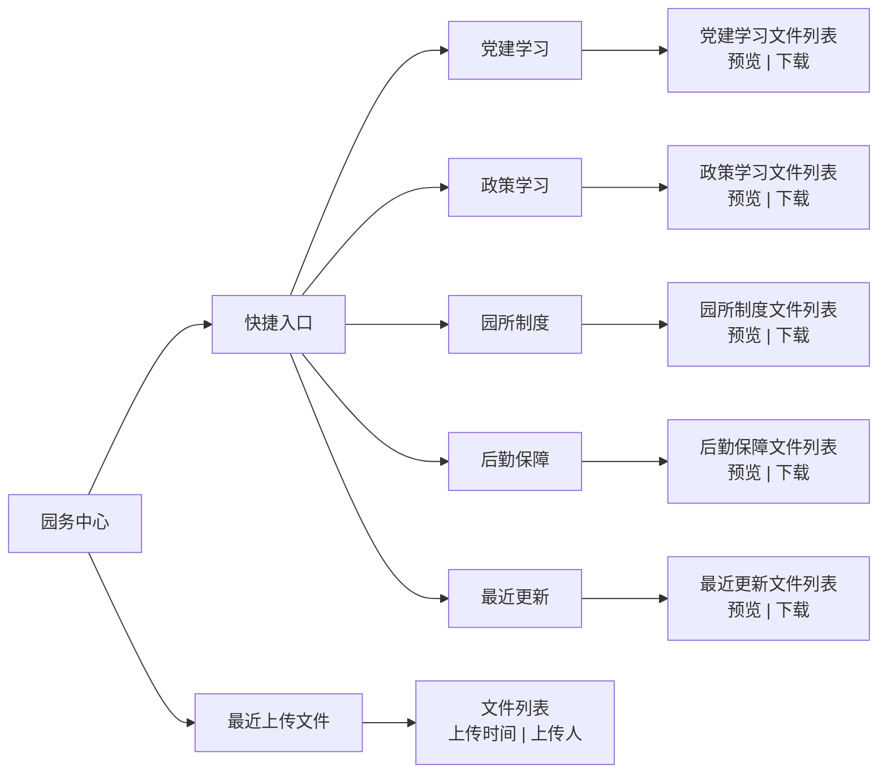

# 园务中心 — 信息架构

> 所属项目：幼儿园教师端小程序 | 返回 [总文档](./IA-信息架构图-Mermaid.md)

---

## 架构图

---

## 模块说明

### 快捷入口

园所日常管理文件的分类入口，包含：

| 分类 | 说明 |
|------|------|
| 党建学习 | 党建相关文件 |
| 政策学习 | 政策法规学习资料 |
| 园所制度 | 园所内部规章制度 |
| 后勤保障 | 后勤管理相关文件 |
| 最近更新 | 近期上传或修改的文件 |

点击任一分类进入文件列表页，每个文件提供预览和下载两个操作按钮。

### 最近上传文件

展示园所最近上传的文件列表，提供预览和下载操作。方便教师快速获取最新发布的文件。

---

## 页面跳转

| 源 | 目标 | 触发方式 |
|----|------|----------|
| 快捷入口 → 分类 | 该分类文件列表页 | 点击分类名称 |
| 文件列表 → 预览 | 文件预览页 | 点击预览按钮 |
| 文件列表 → 下载 | 下载文件 | 点击下载按钮 |
| 最近上传文件 | 文件列表页 | 点击模块区域 |
