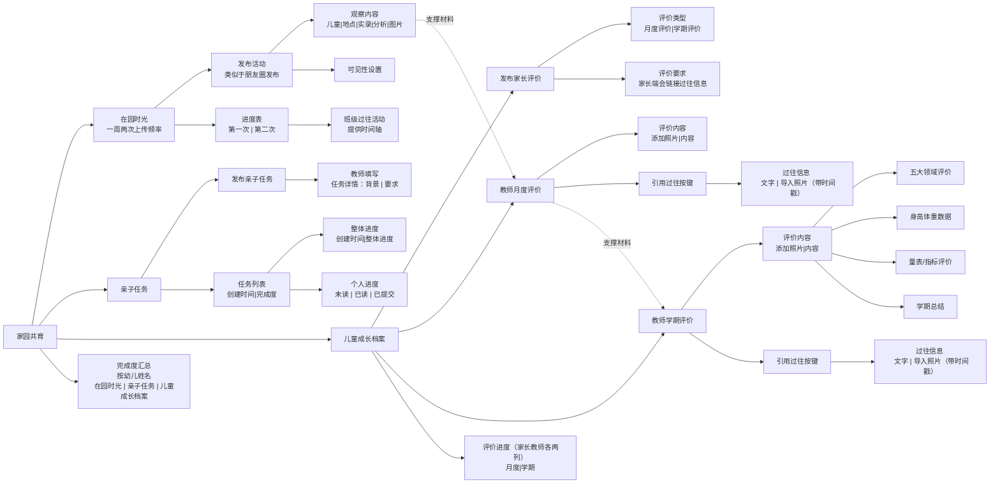

# 家园共育 — 信息架构

> 所属项目：幼儿园教师端小程序 | 返回 [总文档](./IA-信息架构图-Mermaid.md)

---

## 架构图

---

## 模块说明

### 在园时光

> **独立板块**：在园时光是一个日常观察记录模块，不涉及月度评价和学期评价。教师以**集体活动**为单位进行记录（非按每个孩子逐一记录），一周两次上传频率，作为后续月度评价的支撑材料。

教师按集体活动所属观察区域，记录活动的观察地点、观察实录、观察分析并添加图片：

| 观察区域 | 说明 | 记录示例 |
|----------|------|----------|
| 生活 | 进餐、午睡、盥洗、如厕等生活环节 | 独立吃饭、整理被褥 |
| 运动 | 户外体育、晨间锻炼、体育游戏等 | 攀爬、拍球、跳绳 |
| 游戏 | 区域游戏、角色扮演、建构活动等 | 娃娃家对话、积木搭建 |
| 学习 | 集体教学、小组探究、阅读活动等 | 科学实验、绘本阅读 |

| 字段 | 说明 |
|------|------|
| 记录粒度 | 按集体活动（非按每个孩子） |
| 观察地点 | 填写活动发生的具体位置 |
| 观察实录 | 客观描述活动中幼儿的集体表现 |
| 观察分析 | 教师对活动的专业分析与解读 |
| 添加图片 | 上传活动现场照片 |
| 可见性设置 | 可控制该条记录是否对家长可见 |
| 浏览方式 | 按班级 / 按孩子 |
| 上传频率 | 一周两次 |
| 进度表 | 在园时光进度表，按周显示每个孩子的上传完成情况 |

### 亲子任务

教师按班级发布亲子任务，家长阅读后提交照片、文字反馈或评价。

| 功能 | 说明 |
|------|------|
| 发布任务 | 教师按班级发布亲子任务 |
| 家长提交 | 照片、文字反馈、评价 |
| 任务列表 | 主页仅显示当前进行中的任务 |
| 历史任务 | 进入历史菜单后查看各任务的已读、已提交、完成率 |

### 完成度汇总

家园共育主页一级功能。按幼儿姓名展示四项评价任务的完成进度：

| 家长月度 | 家长学期 | 教师月度 | 教师学期 |
|----------|----------|----------|----------|

每列以状态标识（未开始 / 进行中 / 已完成）直观呈现各幼儿的评价进度，方便教师快速掌握全班完成情况。

### 儿童成长档案

教师管理每个孩子成长档案：

#### 评价进度总表

进入儿童成长档案后，呈现**评价进度总表**，四列分布：

| 家长月度 | 家长学期 | 教师月度 | 教师学期 |
|----------|----------|----------|----------|

上方为**教师评价入口**，点击后选择对应幼儿进入评价填写页。

#### 发布任务给家长

向家长发布月度评价和学期评价填写任务。家长月度评价的信息（文字和图片）链接给学期评价，帮助家长完成学期评价。

#### 月度评价

- 提供**按月份查看过往评价**的入口
- 支持估算三年周期内的照片总量
- 在园时光的照片作为月度评价的支撑材料直接调用

#### 学期评价

- 提供**引用入口**：教师可查看该幼儿所有过往月度评价的内容汇总
- 点选过往月度评价中的**照片**（非文字），照片附带时间戳
- 一键导入当前学期评价页面

学期评价包含以下填写内容：

| 字段 | 说明 |
|------|------|
| 五大领域评价 | 健康、语言、社会、科学、艺术 |
| 身高体重数据 | 学期测量数据 |
| 量表/指标评价 | 发展评估指标 |
| 学期总结 | 教师综合评语 |

#### 月度评价 → 学期评价 信息链接

教师侧和家长侧均支持月度评价信息向学期评价的链接调用：

- **左侧**：学期评价填写区。
- **右侧**：该幼儿各月份的月度评语面板，展示每月文字评语与关联图片（带时间戳）。
- **操作**：直接点选右侧月度评价中的照片，图片自动插入左侧学期评价中，减少重复上传和撰写的工作量。

#### 查看孩子档案

汇总每个孩子的完成度状态，支持预览和下载最终档案。

---

## 页面跳转

| 源 | 目标 | 触发方式 |
|----|------|----------|
| 在园时光 → 按孩子 | 该孩子照片列表 | 点击孩子 |
| 在园时光 → 进度表 | 在园时光上传进度表 | 点击进度表 |
| 亲子任务 → 发布 | 新建任务页 | 点击发布 |
| 亲子任务 → 任务列表 | 按孩子浏览提交情况 | 点击任务 |
| 亲子任务 → 历史任务 | 历史任务列表（含完成率） | 点击历史任务 |
| 完成度汇总 | 按幼儿姓名的四列进度表 | 进入完成度汇总 |
| 儿童成长档案 → 评价进度总表 | 四列进度总表 | 进入儿童成长档案 |
| 评价进度总表 → 教师评价入口 | 选择幼儿页 → 评价填写页 | 点击教师评价入口 |
| 评价进度总表 → 月度评价 | 月度评价页（按月份查看过往） | 点击教师月度 |
| 评价进度总表 → 学期评价 | 学期评价页（含引用入口） | 点击教师学期 |
| 学期评价 → 引用入口 | 过往月度评价汇总（照片+时间戳） | 点击引用入口 |
| 儿童成长档案 → 查看档案 | 完成度汇总表 | 点击查看档案 |
| 查看档案 → 预览 | 档案预览页 | 点击预览 |
| 查看档案 → 下载 | 下载档案文件 | 点击下载 |
