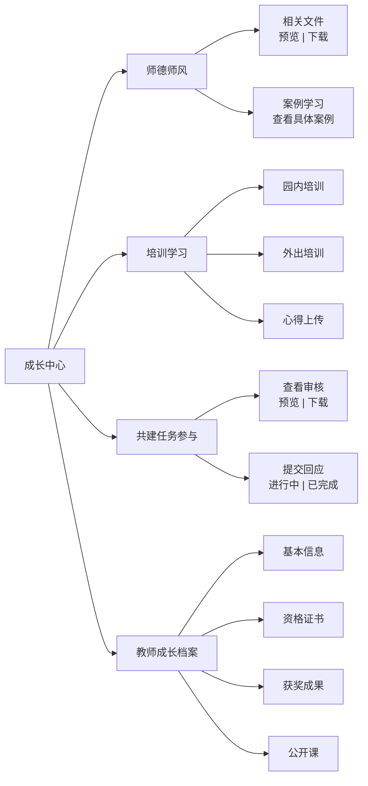

# 成长中心 — 信息架构

> 所属项目：幼儿园教师端小程序 | 返回 [总文档](./IA-信息架构图-Mermaid.md)

---

## 架构图

---

## 模块说明

### 师德师风

教师查阅师德师风相关文件与案例。

| 子功能 | 说明 |
|--------|------|
| 相关文件 | 师德师风政策文件列表，支持预览和下载 |
| 案例学习 | 师德师风典型案例展示，供教师参考学习 |

### 培训学习

教师参与园内外培训的记录与管理。

| 子功能 | 说明 |
|--------|------|
| 园内培训 | 查看园内培训安排、签到记录、培训资料 |
| 外出培训 | 记录外出培训信息，上传培训证明 |
| 心得上传 | 上传培训学习心得或总结文档 |

### 共建任务参与

教师参与课程资源共建任务，查看并提交成果。

| 子功能 | 说明 |
|--------|------|
| 查看任务 | 浏览园所发布的共建任务列表，查看任务要求 |
| 提交材料 | 上传教案、案例等共建成果材料 |
| 查看审核 | 查看已提交材料的审核状态与反馈 |

### 教师成长档案

教师个人专业成长资料的电子档案。

| 子功能 | 说明 |
|--------|------|
| 个人信息 | 教师基本信息，支持编辑更新 |
| 证书成果 | 上传教师资格证、培训证书等成果证明 |
| 获奖记录 | 记录教师获奖情况，支持上传奖状照片 |
| 公开课 | 记录公开课经历，上传课件或课堂记录 |

---

## 页面跳转

| 源 | 目标 | 触发方式 |
|----|------|----------|
| 师德师风 → 相关文件 | 文件列表页 | 点击相关文件 |
| 师德师风 → 案例学习 | 案例详情页 | 点击案例 |
| 培训学习 | 培训详情 | 点击培训项 |
| 共建任务参与 | 提交材料页 | 点击提交 |
| 共建任务 → 提交后 | 园务中心 → 审核列表 | 提交完成 |
| 教师成长档案 | 编辑档案页 | 点击编辑 |

<!-- TODO: 补充更多跳转关系 -->
