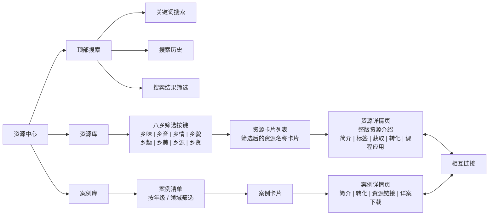

# 资源中心 — 信息架构

> 所属项目：幼儿园教师端小程序 | 返回 [总文档](./IA-信息架构图-Mermaid.md)

---

## 架构图

---

## 模块说明

### 顶部搜索

全平台资源搜索入口。支持关键词搜索、搜索历史记录、按内容类型/年龄段/领域/时间筛选结果，按相关度/时间/浏览量排序。

### 资源库

> **定位**：资源中心以资源本身为核心，强调文化内涵的呈现，教育转化为辅助参考。

进入资源库后，首先呈现**八乡筛选按键**（乡味、乡音、乡情、乡貌、乡趣、乡美、乡源、乡贤）。点击任一标签，下方展示该分类下的**资源卡片列表**。点击具体资源卡片，进入整版资源详情页。

资源详情页包含以下字段：

| 字段 | 说明 |
|------|------|
| 主题 | 资源主题名称 |
| 资源标签 | [八乡标签] |
| 资源解读 | 200 字以内资源概述，突出文化背景与核心内涵 |
| 资源获取 | 300 字以内，教师采集本资源的过程说明 |
| 资源转化 | 200 字以内教育价值与幼儿适宜性分析（辅助参考） |
| 课程应用 | 跳转链接到关联的具体活动案例 |

### 案例库

活动案例库入口。进入后展示**案例清单**，支持通过年级和领域进行筛选：

| 筛选方式 | 选项 |
|----------|------|
| 按年级 | 小班、中班、大班 |
| 按领域 | 语言、艺术、健康、科学、社会 |

筛选后以**案例卡片**形式呈现。点击具体案例卡片，进入案例详情页，包含以下内容：

| 字段 | 说明 |
|------|------|
| 活动主题 | 案例名称 |
| 课程转化 | 300 字以内，将资源与幼儿发展水平连接的具体操作方式 |
| 年级 | 适用年级 |
| 领域 | 所属领域 |
| 活动目标 | 3~5 条学习目标 |
| 活动准备 | 教具、材料、环境布置 |
| 活动流程 | 导入 → 基本环节 → 结束 |
| 活动延伸 | 200 字以内，区域活动、家园共育等拓展 |
| 主题衔接 | 200 字以内，活动与资源主题的关联说明 |
| 相关资源 | 跳转链接回关联的主题资源 |

---

## 搜索系统

### 搜索范围

- 主题资源
- 活动案例

### 筛选维度

| 维度 | 选项 |
|------|------|
| 内容类型 | 主题资源、活动案例 |
| 适用年龄段 | 小班、中班、大班 |
| 活动领域 | 语言、艺术、健康、科学、社会 |
| 发布时间 | 本周、本月、本学期、自定义 |

### 结果排序

- 按相关度
- 按时间
- 按浏览量

---

## 页面跳转

| 源 | 目标 | 触发方式 |
|----|------|----------|
| 资源库 → 八乡筛选 | 该分类下的资源卡片列表 | 点击八乡标签 |
| 资源库 → 资源卡片 | 资源详情页（整版） | 点击资源卡片 |
| 资源详情页 → 课程应用 | 案例详情页 | 点击关联案例链接 |
| 案例库 | 案例清单页（默认全部） | 进入案例库 |
| 案例清单 → 筛选 | 筛选后的案例卡片列表 | 点击年级/领域筛选项 |
| 案例清单 → 案例卡片 | 案例详情页 | 点击案例卡片 |
| 案例详情页 → 相关资源 | 资源详情页 | 点击关联资源链接 |

---

## 资源简介填写模版

> 每位教师填写资源时，请按以下模版逐项完成。所有字段均为必填。以番禺祠堂为例，灰色括号内为填写指引，下方为示例内容。

### 字段说明

| 字段 | 类型 | 字数限制 | 说明 |
|------|------|----------|------|
| 资源名称 | 文本 | ≤20字 | 资源名称，简洁准确 |
| 资源标签 | 多选 | — | 从八乡中选择：乡味 / 乡音 / 乡情 / 乡貌 / 乡趣 / 乡美 / 乡源 / 乡贤 |
| 资源解读 | 长文本 | ≤200字 | 对资源的文化背景、历史渊源、核心内涵进行概述 |
| 资源获取 | 长文本 | ≤300字 | 简述教师如何采集本资源：实地走访拍摄、访谈当地长者、查阅地方志文献、收集民间故事与童谣等 |
| 资源转化 | 长文本 | ≤300字 | 分析该资源的教育价值、幼儿适宜性，以及可转化为哪些学习经验 |
| 课程应用 | 链接 | — | 关联已有的具体活动案例（可多选） |

### 八乡标签速查

| 标签 | 含义 |
|------|------|
| 乡味 | 地方美食、特色小吃、饮食文化 |
| 乡音 | 本土方言、民间歌谣、地方戏曲 |
| 乡情 | 桑梓之情、宗族亲缘、乡土情感纽带 |
| 乡貌 | 自然风光、村落景观、传统建筑风貌 |
| 乡趣 | 民间游戏、传统娱乐、童趣童玩 |
| 乡美 | 传统工艺、民间艺术、审美文化遗产 |
| 乡源 | 历史渊源、地名由来、文化根脉 |
| 乡贤 | 古今名人、乡绅贤达、道德楷模 |

### 填写示例：番禺祠堂

**活动名称**

> （填写案例名称，≤30字）

祠堂里的故事

**活动简介**

> （约100字，描述活动目的与流程）

本活动以番禺沙湾留耕堂（何氏大宗祠）为本土资源载体，引导大班幼儿走近身边的岭南老建筑。活动通过观察祠堂实景、聆听绘本故事、分享家庭团聚经历、合作搭建祠堂模型四个环节，帮助幼儿初步了解祠堂祭祖、团聚、议事的功能，感受其中尊敬祖先、团结家人的情感，萌发对家族与家乡的归属感和认同感。

**课程转化**

> （≤300字，如何将目标资源与幼儿发展水平相连接，提及具体的操作方式）

祠堂这一资源对大班幼儿而言既是陌生的建筑空间，又是与"家"紧密相连的情感载体。在课程转化上，我采用"从具象到抽象"的阶梯式设计：首先让孩子**看一看、摸一摸**——用留耕堂实景照片和拓印的砖雕纹样作为感官入口，降低祠堂的距离感；然后让孩子**搭一搭**——用积木自由搭建"我们的祠堂"，将静态的建筑转化为可操作的建构游戏，在动手过程中理解大门、天井、神龛的空间关系；最后让孩子**说一说**——通过分享家庭团聚经历，将祠堂中的"家族"概念与幼儿自身的家庭经验对接。这种"观察—操作—表达"的路径，符合大班幼儿从具体形象思维向初步逻辑思维过渡的发展特点。

**年级**

> （小班 / 中班 / 大班）

大班

**领域**

> （语言 / 艺术 / 健康 / 科学 / 社会）

社会

**活动目标**

> （3~5条，幼儿在本活动中应达到的学习目标）

1. 初步了解祠堂的功能，知道祠堂是族人祭祀祖先、团聚议事的场所。
2. 感受祠堂中蕴含的尊敬祖先、团结家人的情感。
3. 愿意与同伴分享自己家的"团聚"经历。

**材料准备**

> （教具、材料、环境布置等实物准备）

- 教具：留耕堂实景照片 5~8 张、祠堂内部结构简图 1 张、绘本《祠堂里的故事》
- 材料：画纸、水彩笔、积木若干
- 环境：在语言区布置"番禺老照片"展示角

**经验准备**

> （幼儿前期经验、知识铺垫、前期活动等）

- 幼儿已有与家人团聚的生活经验，能说出家庭成员的基本称呼
- 在前期区域活动中已接触过简单的搭建技巧（垒高、围合）
- 对"老房子""旧建筑"有初步的感知（如见过老家的房子、走过老街等）

**活动流程**

> （导入 → 基本环节 → 结束，含教师引导语）

**一、导入环节**

教师出示留耕堂大门照片，提问："小朋友们，你们见过这么大的门吗？猜猜这是什么地方？" 引导幼儿自由猜测，激发好奇心。

**二、基本环节**

1. **看一看**：教师依次展示祠堂照片（大门→天井→大厅→神龛），引导幼儿观察并描述"你看到了什么？""这里和我们的家有什么不一样？"
2. **听一听**：教师讲述绘本《祠堂里的故事》，重点呈现祠堂里一家人团聚、祭祖、吃团圆饭的画面。
3. **说一说**：请幼儿分享"我们家什么时候会一家人聚在一起？做了什么？" 教师引导归纳"团聚"的含义。
4. **搭一搭**：幼儿分组用积木合作搭建"我们的祠堂"，教师巡回指导。

**三、结束环节**

各组展示搭建作品，请幼儿介绍"你们的祠堂里可以做什么？" 教师总结：祠堂是家人团聚的地方，我们要尊敬长辈、爱自己的家人。

**活动延伸**

> （≤200字，可拓展到区域活动、家园共育、后续活动等）

在美工区投放砖雕纹样图片，引导幼儿用拓印或线描的方式创作"祠堂花纹"；鼓励家长周末带孩子参观附近的祠堂或老建筑，拍照记录后在班级分享；后续可生成"我家的故事"系列主题活动。

**相关资源**

> （跳转回关联的主题资源）

- [祠堂]()

