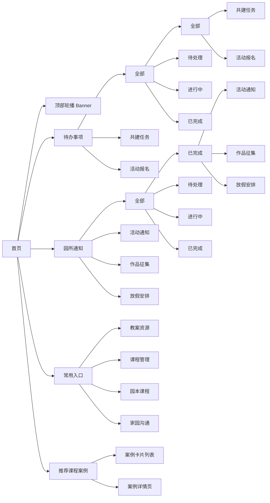

# 首页 — 信息架构

> 所属项目：幼儿园教师端小程序 | 返回 [总文档](./IA-信息架构图-Mermaid.md)

---

## 架构图

---

## 模块说明

### 顶部轮播 Banner

展示重点推荐的优质课程案例，支持自动轮播和手动滑动，点击跳转案例详情页。

### 待办事项

聚合教师需要处理的工作提醒，按类型和状态分类。

| 分类 | 说明 |
|------|------|
| 全部 | 汇总所有待办事项，按状态筛选：全部 / 待处理 / 进行中 / 已完成 |
| 资源审核 | 待教师审核的资源列表 |
| 共建任务 | 待教师参与的课程共建任务 |
| 活动报名 | 待教师报名的园所活动 |

### 园所通知

园所发布的各类通知，按类型和状态分类。

| 分类 | 说明 |
|------|------|
| 全部 | 汇总所有通知，按状态筛选：全部 / 待处理 / 进行中 / 已完成 |
| 活动通知 | 园所活动相关通知 |
| 作品征集 | 教师作品征集通知 |
| 放假安排 | 节假日放假安排通知 |

### 常用入口

高频功能的快捷 Icon 入口，方便教师快速跳转。

| 入口 | 跳转目标 |
|------|----------|
| 教案资源 | 资源中心 |
| 课程管理 | 资源中心 |
| 园本课程 | 资源中心 |
| 家园沟通 | 家园共育 |

### 推荐课程案例

横向滑动卡片展示优质案例，点击进入案例详情页。

---

## 页面跳转

| 源 | 目标 | 触发方式 |
|----|------|----------|
| 顶部轮播 | 案例详情页 | 点击轮播图 |
| 待办事项 → 资源审核 | 资源审核列表 | 点击待办卡片 |
| 待办事项 → 共建任务 | 共建任务列表 | 点击待办卡片 |
| 待办事项 → 活动报名 | 活动报名管理 | 点击待办卡片 |
| 园所通知 → 活动通知 | 通知详情页 | 点击通知 |
| 园所通知 → 作品征集 | 征集详情页 | 点击通知 |
| 园所通知 → 放假安排 | 通知详情页 | 点击通知 |
| 常用入口 → 教案资源 | 资源中心 | 点击入口 Icon |
| 常用入口 → 课程管理 | 资源中心 | 点击入口 Icon |
| 常用入口 → 园本课程 | 资源中心 | 点击入口 Icon |
| 常用入口 → 家园沟通 | 家园共育 | 点击入口 Icon |
| 推荐课程案例 | 案例详情页 | 点击案例卡片 |
