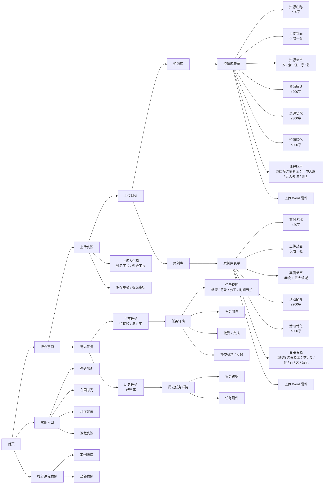
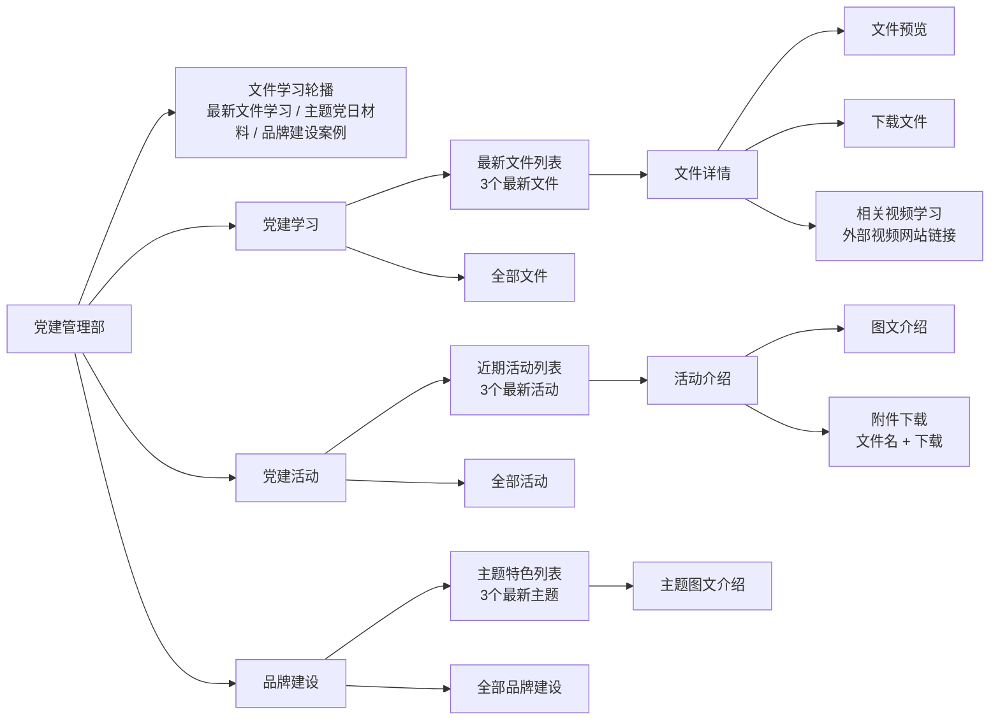
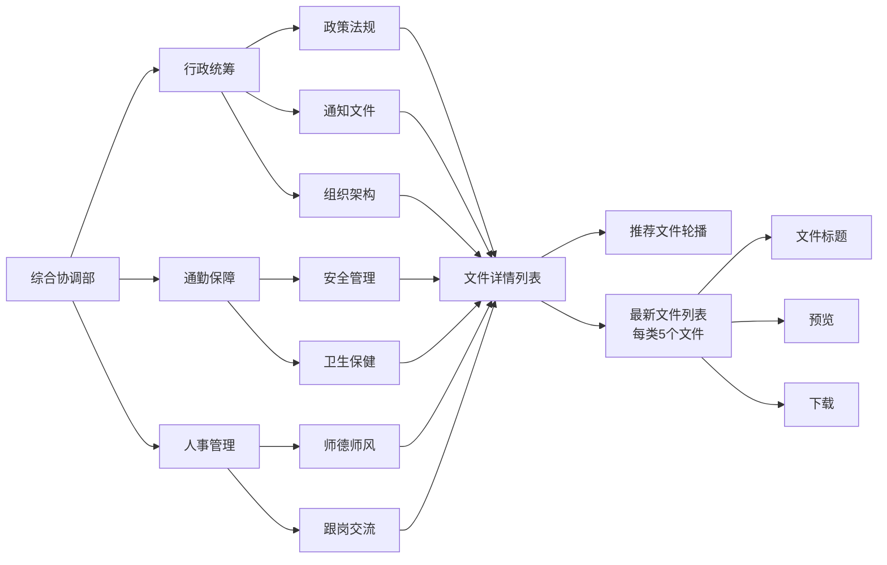
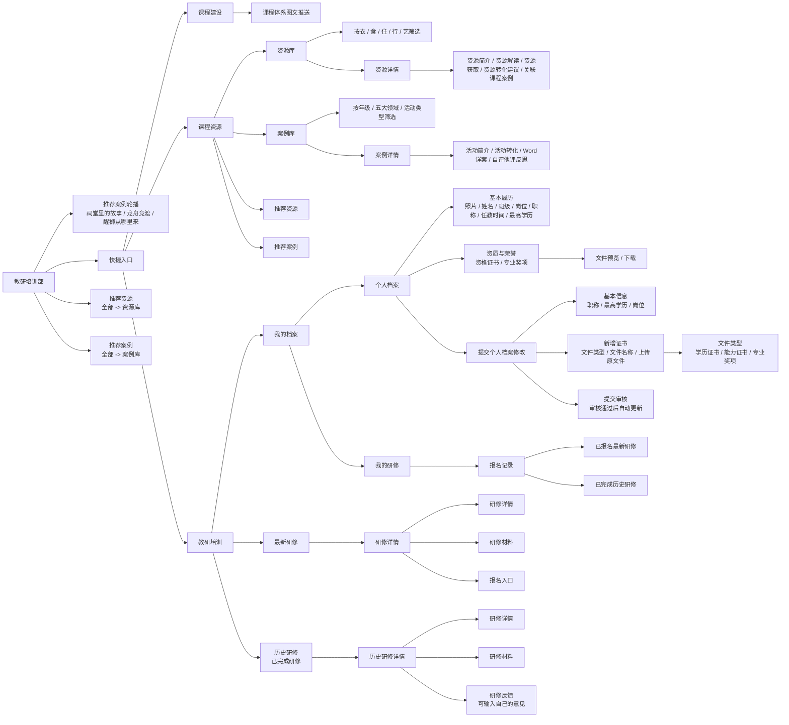
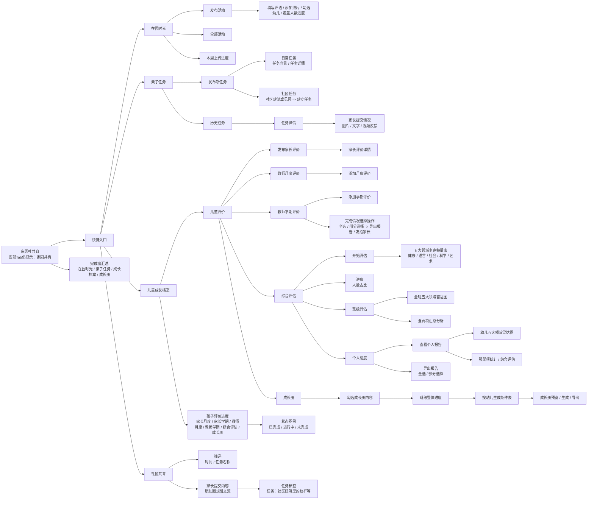

# 首页

```mermaid
flowchart LR
    Home["首页"]

    Home --> Todo["待办事项"]
    Todo --> Upload["上传资源"]
    Todo --> TeacherTasks["待办任务"]

    Upload --> UploadTarget["上传目标"]
    UploadTarget --> UploadResource["资源库"]
    UploadTarget --> UploadCase["案例库"]
    Upload --> UploaderInfo["上传人信息<br/>姓名下拉 / 班级下拉"]

    UploadResource --> ResourceFields["资源库表单"]
    ResourceFields --> ResourceName["资源名称<br/>≤20字"]
    ResourceFields --> ResourceCover["上传封面<br/>仅限一张"]
    ResourceFields --> ResourceTag["资源标签<br/>衣 / 食 / 住 / 行 / 艺"]
    ResourceFields --> ResourceExplain["资源解读<br/>≤200字"]
    ResourceFields --> ResourceAccess["资源获取<br/>≤300字"]
    ResourceFields --> ResourceTransform["资源转化<br/>≤200字"]
    ResourceFields --> CourseApply["课程应用<br/>弹层筛选案例库：小中大班 / 五大领域 / 暂无"]
    ResourceFields --> ResourceWord["上传 Word 附件"]

    UploadCase --> CaseFields["案例库表单"]
    CaseFields --> CaseName["案例名称<br/>≤20字"]
    CaseFields --> CaseCover["上传封面<br/>仅限一张"]
    CaseFields --> CaseTag["案例标签<br/>年级 + 五大领域"]
    CaseFields --> CaseIntro["活动简介<br/>≤200字"]
    CaseFields --> CaseTransform["活动转化<br/>≤300字"]
    CaseFields --> RelatedResource["关联资源<br/>弹层筛选资源库：衣 / 食 / 住 / 行 / 艺 / 暂无"]
    CaseFields --> CaseWord["上传 Word 附件"]
    Upload --> UploadActions["保存草稿 / 提交审核"]

    TeacherTasks --> CurrentTasks["当前任务<br/>待接收 / 进行中"]
    TeacherTasks --> HistoryTasks["历史任务<br/>已完成"]
    CurrentTasks --> TaskDetail["任务详情"]
    HistoryTasks --> HistoryDetail["历史任务详情"]
    TaskDetail --> TaskInfo["任务说明<br/>标题 / 背景 / 分工 / 时间节点"]
    TaskDetail --> TaskFiles["任务附件"]
    TaskDetail --> TaskActions["接受 / 完成"]
    TaskDetail --> SubmitMaterial["提交材料 / 反馈"]
    HistoryDetail --> HistoryInfo["任务说明"]
    HistoryDetail --> HistoryFiles["任务附件"]

    Home --> Quick["常用入口"]
    Quick --> TrainingList["教研培训"]
    Quick --> Moments["在园时光"]
    Quick --> MonthlyEval["月度评价"]
    Quick --> CourseResource["课程资源"]

    Home --> RecommendCases["推荐课程案例"]
    RecommendCases --> CaseDetail["案例详情"]
    RecommendCases --> CaseLibrary["全部案例"]
```

# 党建管理

```mermaid
flowchart LR
    Party["党建管理部"]

    Party --> PartyBanner["文件学习轮播<br/>最新文件学习 / 主题党日材料 / 品牌建设案例"]

    Party --> Study["党建学习"]
    Study --> StudyLatest["最新文件列表<br/>3个最新文件"]
    Study --> StudyAll["全部文件"]
    StudyLatest --> StudyDetail["文件详情"]
    StudyDetail --> StudyPreview["文件预览"]
    StudyDetail --> StudyDownload["下载文件"]
    StudyDetail --> StudyVideos["相关视频学习<br/>外部视频网站链接"]

    Party --> Activity["党建活动"]
    Activity --> ActivityLatest["近期活动列表<br/>3个最新活动"]
    Activity --> ActivityAll["全部活动"]
    ActivityLatest --> ActivityDetail["活动介绍"]
    ActivityDetail --> ActivityGraphic["图文介绍"]
    ActivityDetail --> ActivityFiles["附件下载<br/>文件名 + 下载"]

    Party --> Brand["品牌建设"]
    Brand --> BrandLatest["主题特色列表<br/>3个最新主题"]
    Brand --> BrandAll["全部品牌建设"]
    BrandLatest --> BrandDetail["主题图文介绍"]
```

# 综合协调

```mermaid
flowchart LR
    Coordination["综合协调部"]

    Coordination --> Admin["行政统筹"]
    Admin --> Policy["政策法规"]
    Admin --> Notice["通知文件"]
    Admin --> Org["组织架构"]

    Coordination --> Commute["通勤保障"]
    Commute --> Safety["安全管理"]
    Commute --> Health["卫生保健"]

    Coordination --> HR["人事管理"]
    HR --> Ethics["师德师风"]
    HR --> Exchange["跟岗交流"]

    Policy --> FileList["文件详情列表"]
    Notice --> FileList
    Org --> FileList
    Safety --> FileList
    Health --> FileList
    Ethics --> FileList
    Exchange --> FileList

    FileList --> RecommendFiles["推荐文件轮播"]
    FileList --> LatestFiles["最新文件列表<br/>每类5个文件"]
    LatestFiles --> FileTitle["文件标题"]
    LatestFiles --> Preview["预览"]
    LatestFiles --> Download["下载"]
```

# 教研培训

```mermaid
flowchart LR
    Training["教研培训部"]

    Training --> CaseBanner["推荐案例轮播<br/>祠堂里的故事 / 龙舟竞渡 / 醒狮从哪里来"]

    Training --> QuickEntry["快捷入口"]
    QuickEntry --> CourseBuild["课程建设"]
    QuickEntry --> ResourceCenter["课程资源"]
    QuickEntry --> TrainingList["教研培训"]

    CourseBuild --> CourseArticle["课程体系图文推送"]

    ResourceCenter --> ResourceLibrary["资源库"]
    ResourceLibrary --> ResourceCategory["按衣 / 食 / 住 / 行 / 艺筛选"]
    ResourceLibrary --> ResourceDetail["资源详情"]
    ResourceDetail --> ResourceContent["资源简介 / 资源解读 / 资源获取 / 资源转化建议 / 关联课程案例"]

    ResourceCenter --> CaseLibrary["案例库"]
    CaseLibrary --> CaseFilter["按年级 / 五大领域 / 活动类型筛选"]
    CaseLibrary --> CaseDetail["案例详情"]
    CaseDetail --> CaseContent["活动简介 / 活动转化 / Word详案 / 自评他评反思"]

    ResourceCenter --> RecommendResource["推荐资源"]
    ResourceCenter --> RecommendCase["推荐案例"]

    TrainingList --> MyArchive["我的档案"]
    MyArchive --> TeacherProfile["个人档案"]
    MyArchive --> MyTraining["我的研修"]

    TeacherProfile --> Resume["基本履历<br/>照片 / 姓名 / 班级 / 岗位 / 职称 / 任教时间 / 最高学历"]
    TeacherProfile --> Qualification["资质与荣誉<br/>资格证书 / 专业奖项"]
    Qualification --> FilePreviewDownload["文件预览 / 下载"]
    TeacherProfile --> ProfileEdit["提交个人档案修改"]
    ProfileEdit --> BasicEdit["基本信息<br/>职称 / 最高学历 / 岗位"]
    ProfileEdit --> CertificateUpload["新增证书<br/>文件类型 / 文件名称 / 上传原文件"]
    CertificateUpload --> CertificateTypes["文件类型<br/>学历证书 / 能力证书 / 专业奖项"]
    ProfileEdit --> AuditUpdate["提交审核<br/>审核通过后自动更新"]

    MyTraining --> SignupRecords["报名记录"]
    SignupRecords --> SignedLatest["已报名最新研修"]
    SignupRecords --> SignedHistory["已完成历史研修"]

    TrainingList --> LatestTraining["最新研修"]
    TrainingList --> HistoryTraining["历史研修<br/>已完成研修"]

    LatestTraining --> LatestDetail["研修详情"]
    LatestDetail --> LatestInfo["研修详情"]
    LatestDetail --> LatestMaterials["研修材料"]
    LatestDetail --> Signup["报名入口"]

    HistoryTraining --> HistoryDetail["历史研修详情"]
    HistoryDetail --> HistoryInfo["研修详情"]
    HistoryDetail --> HistoryMaterials["研修材料"]
    HistoryDetail --> Feedback["研修反馈<br/>可输入自己的意见"]

    Training --> TrainingRecommendResource["推荐资源<br/>全部 -> 资源库"]
    Training --> TrainingRecommendCase["推荐案例<br/>全部 -> 案例库"]
```

# 家园共育

```mermaid
flowchart LR
    HomeSchool["家园社共育<br/>底部Tab仍显示：家园共育"]

    HomeSchool --> HomeSchoolQuick["快捷入口"]
    HomeSchoolQuick --> Moments["在园时光"]
    HomeSchoolQuick --> ParentTasks["亲子任务"]
    HomeSchoolQuick --> GrowthRecord["儿童成长档案"]
    HomeSchoolQuick --> CommunityCoeducation["社区共育"]

    HomeSchool --> Summary["完成度汇总<br/>在园时光 / 亲子任务 / 成长档案 / 成长册"]

    Moments --> MomentPublish["发布活动"]
    MomentPublish --> MomentForm["填写评语 / 添加照片 / 勾选幼儿 / 覆盖人数进度"]
    Moments --> MomentFeed["全部活动"]
    Moments --> WeeklyProgress["本周上传进度"]

    ParentTasks --> PublishTask["发布新任务"]
    PublishTask --> DailyTask["日常任务<br/>任务背景 / 任务详情"]
    PublishTask --> CommunityTask["社区任务<br/>社区建筑或见闻 -> 建立任务"]
    ParentTasks --> ParentTaskHistory["历史任务"]
    ParentTaskHistory --> ParentTaskDetail["任务详情"]
    ParentTaskDetail --> ParentSubmission["家长提交情况<br/>图片 / 文字 / 视频反馈"]

    GrowthRecord --> ChildEvaluation["儿童评价"]
    ChildEvaluation --> ParentEvalPublish["发布家长评价"]
    ChildEvaluation --> GrowthBook["成长册"]
    ChildEvaluation --> TeacherMonthly["教师月度评价"]
    ChildEvaluation --> TeacherTerm["教师学期评价"]
    ChildEvaluation --> ComprehensiveAssessment["综合评估"]

    ParentEvalPublish --> ParentEvalDetail["家长评价详情"]
    TeacherMonthly --> TeacherMonthlyForm["添加月度评价"]
    TeacherTerm --> TeacherTermForm["添加学期评价"]
    TeacherTerm --> SelectExportShare["完成情况选择操作<br/>全选 / 部分选择 -> 导出报告 / 发给家长"]

    ComprehensiveAssessment --> StartAssessment["开始评估"]
    StartAssessment --> Likert["五大领域李克特量表<br/>健康 / 语言 / 社会 / 科学 / 艺术"]
    ComprehensiveAssessment --> AssessmentProgress["进度<br/>人数占比"]
    ComprehensiveAssessment --> ClassReport["班级评估"]
    ClassReport --> ClassRadar["全班五大领域雷达图"]
    ClassReport --> ClassAnalysis["强弱项汇总分析"]
    ComprehensiveAssessment --> PersonalProgress["个人进度"]
    PersonalProgress --> PersonalReport["查看个人报告"]
    PersonalReport --> PersonalRadar["幼儿五大领域雷达图"]
    PersonalReport --> PersonalAnalysis["强弱项统计 / 综合评估"]
    PersonalProgress --> ExportAssessment["导出报告<br/>全选 / 部分选择"]

    GrowthRecord --> ProgressTable["孩子评价进度<br/>家长月度 / 家长学期 / 教师月度 / 教师学期 / 综合评估 / 成长册"]
    ProgressTable --> StatusLegend["状态图例<br/>已完成 / 进行中 / 未完成"]

    GrowthBook --> SelectContent["勾选成长册内容"]
    SelectContent --> BookProgress["班级整体进度"]
    BookProgress --> GenerateTable["按幼儿生成条件表"]
    GenerateTable --> ExportBook["成长册预览 / 生成 / 导出"]

    CommunityCoeducation --> CommunityFilters["筛选<br/>时间 / 任务名称"]
    CommunityCoeducation --> ParentFeed["家长提交内容<br/>朋友圈式图文流"]
    ParentFeed --> TaskLabel["任务标签<br/>任务：社区建筑里的纹样等"]
```
